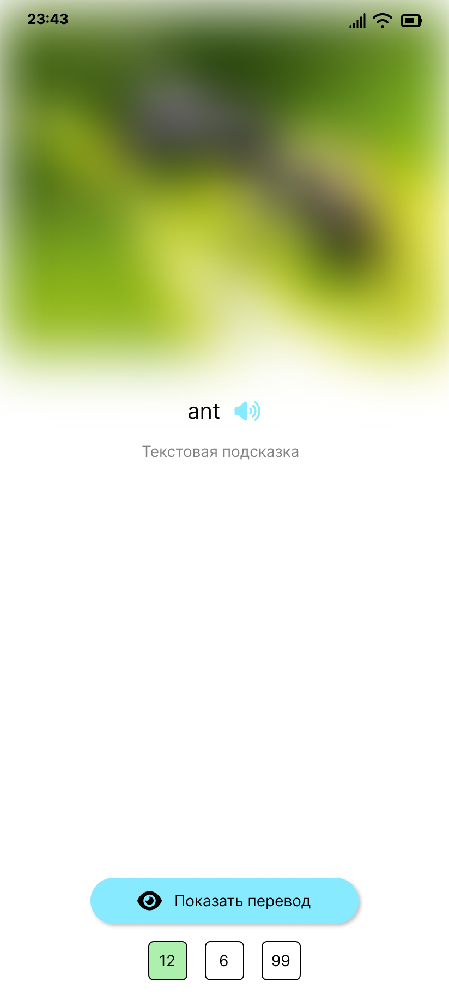
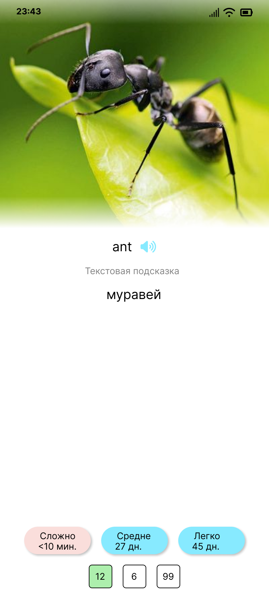

# UX-гайд

| Поле | Значение |
| --- | --- |
| Цель | Зафиксировать принципы UX и ожидаемое поведение ключевых сценариев |
| Аудитория | Разработчики, дизайнеры, AI агент |
| Ответственный | Команда разработки |
| Последнее обновление | 2025-12-23 |
| Связанные документы | [Типы карточек](../cards/card_types.md), [Архитектура](../architecture/README.md) |
| Ключевые файлы | `fragment/`, `LessonListFragment`, `DictionaryListFragment`, `CollectionListFragment`, `SettingsFragment` |

## Цели и принципы

- **Фокус на обучении**: экраны минималистичны, отдают приоритет слову и его переводу; вспомогательные элементы не отвлекают.
- **Предсказуемость**: все типы карточек используют единый паттерн навигации (жест назад, кнопки, озвучка).
- **Доступность**: контент читабелен, элементы управления крупные; поддерживается озвучка английских слов и использование screen reader.
- **Последовательность**: одинаковые состояния отображаются единообразно (loading, success, error).

## Ключевые сценарии

### Список уроков (`LessonListFragment`)

Стартовый экран. 
Показывает отсортированный список уроков, кнопку создания урока, элементы навигации на другие фрагменты.

#### Макет (Figma)

- Макет: [Lesson list - v2026-01-06](https://www.figma.com/design/OzT41qSNo3HhUFMMrj7bDM/Tala?node-id=50-2&t=Qmv7Re8GcNDsdqHq-4)
- Превью: 

Ключевые элементы:
- В верхней части — кнопки навигации к коллекциям, словарю и настройкам.
- Список уроков в виде карточек с наименованием урока, количество новых, возвращенных и карточек на повторение. А так же кнопка перехода в настройки урока;
- При нажатии на карточку урока происходит переход в урок для тренировки;
- Кнопка создания нового урока, поверх списка уроков, в нижней части

### Словарь (`DictionaryListFragment`)

- Список слов с группировкой по базовым словам.
- Переход к созданию/редактированию записи через `DictionaryAddFragment`.

### Коллекции (`CollectionListFragment`)

- Список коллекций слов, переход к созданию/редактированию через `CollectionAddFragment`.
- Отображает пустое состояние и ошибки загрузки.

### Настройки (`SettingsFragment`)

- Управление параметрами интервальных повторений и очисткой данных.

### Карточка - перевод (`TranslateCardTypeFragment`)

Карточка для урока. В данном типе карточки пользователь видит слово на английском и ему необходимо вспомнить перевод на русский.

#### Макет (Figma)

- Макет вопрос: [Translate card type](https://www.figma.com/design/OzT41qSNo3HhUFMMrj7bDM/Tala?node-id=66-26&t=XMvpkt7N4g9hvbwc-4)
- Превью вопрос: 
- Макет ответ: [Translate card type](https://www.figma.com/design/OzT41qSNo3HhUFMMrj7bDM/Tala?node-id=70-121&t=XMvpkt7N4g9hvbwc-4)
- Превью ответ: 
- 
#### Расположение элементов (сверху вниз):

1. **Изображение-подсказка** (опционально):
    - Расположено в верхней части карточки
    - Фиксированная высота, без ограничения по соотношению сторон
    - Имеет градиентный overlay только по краям: верх 16dp (`gradient_top.xml`), низ 32dp (`gradient_bottom.xml`), центр без градиента
    - Во время вопроса размывается (blur 25px)
    - После показа ответа размытие убирается

2. **Слово на английском**:
    - Расположено по центру, под изображением
    - Крупный текст (HeadlineSmall, жирный)
    - Справа от слова — кнопка озвучки (иконка динамика)
    - При нажатии на кнопку произносится слово через TextToSpeech

3. **Текстовая подсказка** (опционально):
    - Расположена под словом на английском
    - Отображается только если подсказка задана
    - Серый цвет текста, с иконкой информации слева

4. **Перевод на русском**:
    - Отображается только после нажатия кнопки "Показать ответ"
    - Расположен по центру, под текстовой подсказкой
    - Крупный текст (HeadlineSmall, жирный)

5. **Кнопка "Показать ответ"**:
    - Отображается только в состоянии вопроса
    - Расположена по центру, под переводом (когда скрыт)
    - Скругление ~24dp, тень 6dp, фон голубой (`lesson_card_bg`), иконка глаза слева (черная)
    - При нажатии скрывается и показываются кнопки качества ответа

6. **Кнопки выбора качества ответа**:
    - Отображаются только после показа ответа
    - Расположены горизонтально, по центру
    - Три кнопки: "Сложно", "Средне", "Легко"
    - Равная ширина: 102dp каждая
    - Скругление: 21dp
    - Тень: 6dp (elevation)
    - Текст в две строки:
        - Первая строка: название качества ("Сложно", "Средне", "Легко")
        - Вторая строка: интервал до следующего повторения ("<10 мин.", "1 дн.", "27 дн." и т.д.)
    - Стиль: заливка пастельными цветами: "Сложно" — #F4D4D1; "Средне" и "Легко" — #7EE3F7; текст черный

7. **Статистика карточек урока**:
    - Расположена внизу карточки, по центру
    - Три квадратных элемента размером 36x36dp
    - Каждый элемент содержит число (количество карточек)
    - Элементы расположены горизонтально с отступами 16dp между ними
    - Фон: белый с черной обводкой (1dp), скругление 5dp
    - Подсветка активного элемента в зависимости от статуса текущей карточки:
        - **Новая карточка** (`StatusEnum.NEW`): светло-зеленый фон (#ADEFAD) для элемента "Новых карточек"
        - **Возвращенная карточка** (`StatusEnum.PROGRESS_RESET`): светло-красный фон (#FBE8E7) для элемента "Возвращенных карточек"
        - **На изучении** (`StatusEnum.IN_PROGRESS`): светло-зеленый фон (#ADEFAD) для элемента "Карточек на повторение"
    - Неактивные элементы имеют белый фон
    - Статистика загружается асинхронно при создании фрагмента

Реализация (dev notes):
- Для оверлея изображения используется `@drawable/translate_card_image_overlay` с двумя слоями: `gradient_top.xml` (16dp сверху) и `gradient_bottom.xml` (32dp снизу).
- Счетчики статистики используют фон `@drawable/translate_card_stat_background` с белым фоном, черной обводкой и скруглением 5dp; подсветка статусов задается tint-программно.
- Кнопки оценки — заливка (`translate_card_hard_bg` / `translate_card_medium_bg` / `translate_card_easy_bg`), радиус 21dp, elevation 6dp, равная ширина (102dp минимум) и двухстрочный текст по центру.
- Кнопка "Показать ответ" — фон `lesson_card_bg`, радиус ~24dp, elevation 6dp, иконка глаза (`ic_visibility`, tint black) слева от текста.

## Компонентная библиотека

- **Кнопки**: primary (сплошная, отступы 16dp), secondary (контур), оценочные (равная ширина, цветовая дифференциация для статусов).
- **Карточки**: фон светлый (`colors/cardBackground`), скругление 12dp, тень минимальная, отступы 16dp.
- **Текст**: заголовок (`TextAppearance.MaterialComponents.Headline6`) для слова, обычный текст для подсказок, шрифт — системный Roboto.
- **Состояния**: для загрузки используется `ProgressBar` в центре; ошибки выводятся во всплывающем `Snackbar`.

## Стили и тональность

- Текст интерфейса — на русском, без жаргона (например, «Сложно», «Средне», «Легко»).
- Подсказки и описания — короткие (до 2 предложений), избегаем пассивных конструкций.
- Цветовая палитра следует `colors.xml`: акцентные цвета для кнопок оценки, фоновый — нейтральный.

## Доступность и локализация

- Все интерактивные элементы имеют `contentDescription` или текстовые лейблы.
- Для изображений добавляется альтернативный текст (название или назначение подсказки).
- Проверяй контраст по WCAG AA: текст на кнопках должен быть читаем на фоне.
- Поддерживаются `ru` и `en` локали; строки хранятся в `strings.xml`.

## Чек-лист при изменениях

- Проверь, что новый экран следует принципам минимализма и не перегружен элементами.
- Обнови `ux_guide.md`, если изменяются паттерны (например, новая навигация или кнопки действий).
- Убедись, что навигация между фрагментами согласована с `MainActivity`.
- Дополняй документацию ссылками на макеты (Figma, скриншоты) при наличии.

