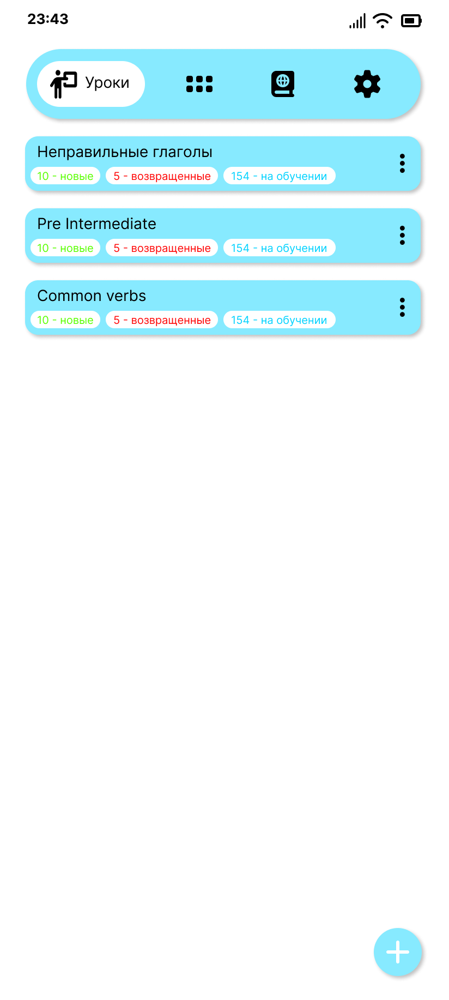

# UX-гайд

| Поле | Значение |
| --- | --- |
| Цель | Зафиксировать принципы UX и ожидаемое поведение ключевых сценариев |
| Аудитория | Разработчики, дизайнеры, AI агент |
| Ответственный | Команда разработки |
| Последнее обновление | 2025-12-23 |
| Связанные документы | [Типы карточек](../cards/card_types.md), [Архитектура](../architecture/README.md) |
| Ключевые файлы | `fragment/`, `LessonListFragment`, `DictionaryListFragment`, `CollectionListFragment`, `SettingsFragment` |

## Цели и принципы

- **Фокус на обучении**: экраны минималистичны, отдают приоритет слову и его переводу; вспомогательные элементы не отвлекают.
- **Предсказуемость**: все типы карточек используют единый паттерн навигации (жест назад, кнопки, озвучка).
- **Доступность**: контент читабелен, элементы управления крупные; поддерживается озвучка английских слов и использование screen reader.
- **Последовательность**: одинаковые состояния отображаются единообразно (loading, success, error).

## Ключевые сценарии

### Список уроков (`LessonListFragment`)

Стартовый экран. 
Показывает отсортированный список уроков, кнопку создания урока, элементы навигации на другие фрагменты.

#### Макет (Figma)

- Макет: [Lesson list - v2026-01-06](https://www.figma.com/design/OzT41qSNo3HhUFMMrj7bDM/Tala?node-id=50-2&t=Qmv7Re8GcNDsdqHq-4)
- Превью: 

Ключевые элементы:
- В верхней части — кнопки навигации к коллекциям, словарю и настройкам.
- Список уроков в виде карточек с наименованием урока, количество новых, возвращенных и карточек на повторение. А так же кнопка перехода в настройки урока;
- При нажатии на карточку урока происходит переход в урок для тренировки;
- Кнопка создания нового урока, поверх списка уроков, в нижней части

### Словарь (`DictionaryListFragment`)

- Список слов с группировкой по базовым словам.
- Переход к созданию/редактированию записи через `DictionaryAddFragment`.

### Коллекции (`CollectionListFragment`)

- Список коллекций слов, переход к созданию/редактированию через `CollectionAddFragment`.
- Отображает пустое состояние и ошибки загрузки.

### Настройки (`SettingsFragment`)

- Управление параметрами интервальных повторений и очисткой данных.

## Компонентная библиотека

- **Кнопки**: primary (сплошная, отступы 16dp), secondary (контур), оценочные (равная ширина, цветовая дифференциация для статусов).
- **Карточки**: фон светлый (`colors/cardBackground`), скругление 12dp, тень минимальная, отступы 16dp.
- **Текст**: заголовок (`TextAppearance.MaterialComponents.Headline6`) для слова, обычный текст для подсказок, шрифт — системный Roboto.
- **Состояния**: для загрузки используется `ProgressBar` в центре; ошибки выводятся во всплывающем `Snackbar`.

## Стили и тональность

- Текст интерфейса — на русском, без жаргона (например, «Сложно», «Средне», «Легко»).
- Подсказки и описания — короткие (до 2 предложений), избегаем пассивных конструкций.
- Цветовая палитра следует `colors.xml`: акцентные цвета для кнопок оценки, фоновый — нейтральный.

## Доступность и локализация

- Все интерактивные элементы имеют `contentDescription` или текстовые лейблы.
- Для изображений добавляется альтернативный текст (название или назначение подсказки).
- Проверяй контраст по WCAG AA: текст на кнопках должен быть читаем на фоне.
- Поддерживаются `ru` и `en` локали; строки хранятся в `strings.xml`.

## Чек-лист при изменениях

- Проверь, что новый экран следует принципам минимализма и не перегружен элементами.
- Обнови `ux_guide.md`, если изменяются паттерны (например, новая навигация или кнопки действий).
- Убедись, что навигация между фрагментами согласована с `MainActivity`.
- Дополняй документацию ссылками на макеты (Figma, скриншоты) при наличии.

